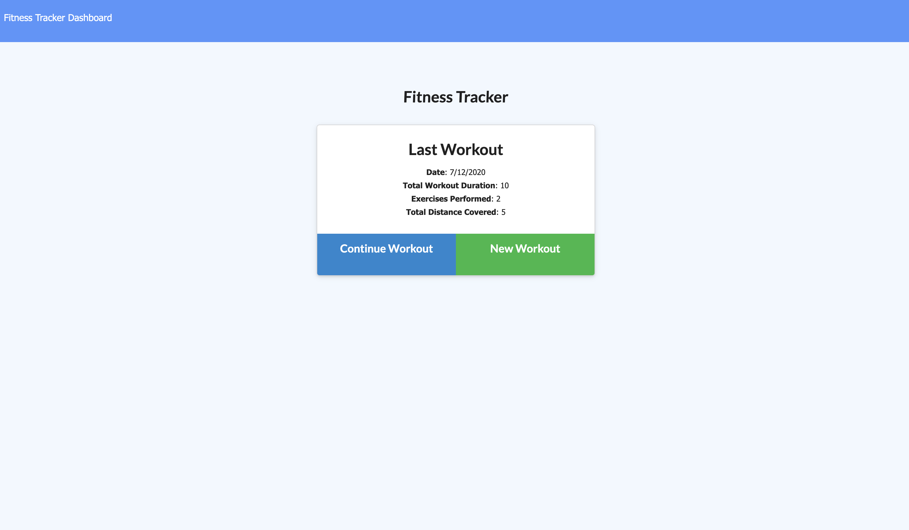
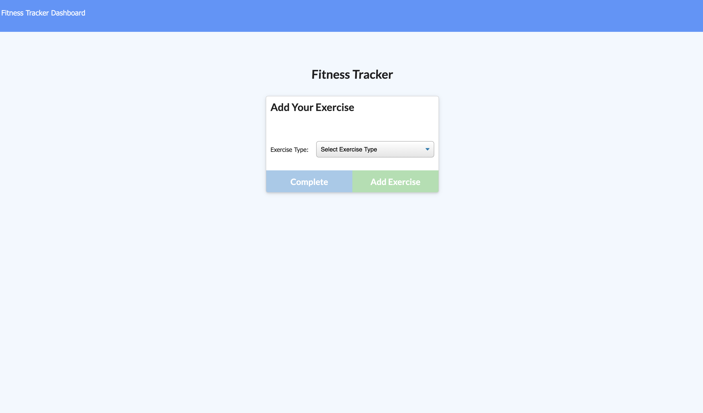
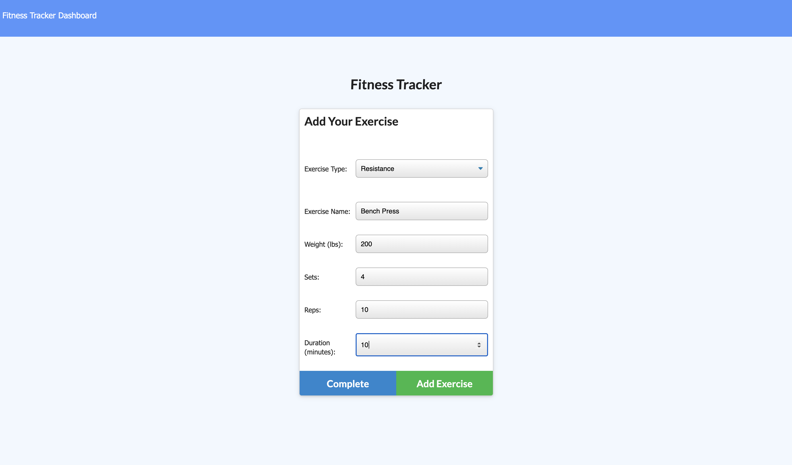
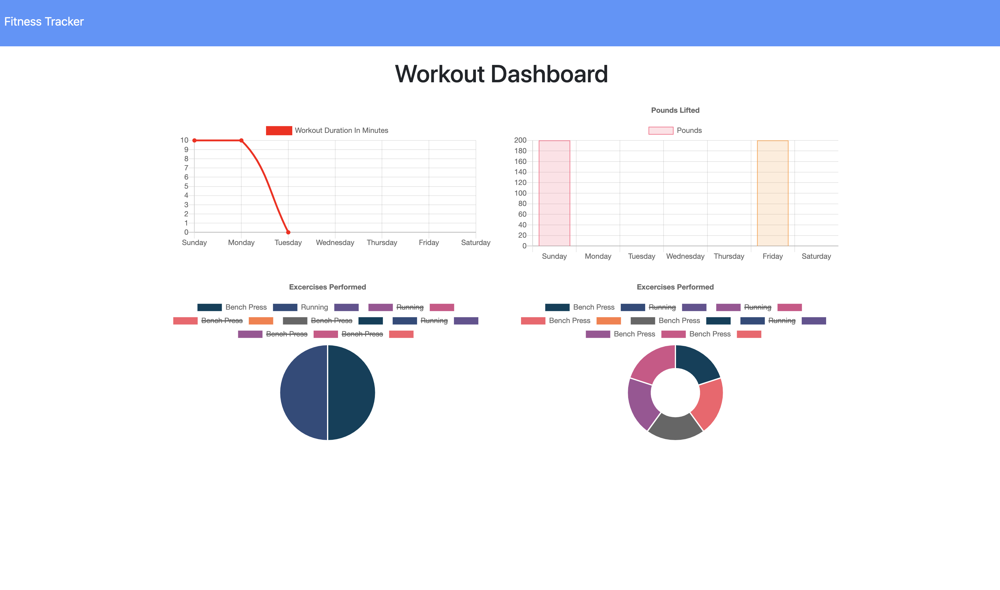

# Workout Tracker

# **Project Description**
For this project I built a a workout tracker using MongoDB. Users can enter the details of their workout and add additional excercises to their workout. Once they click complete workout they can vew stats about their workout. 

# **Live Link**
[Heroku](https://agile-everglades-70833.herokuapp.com/)

# **Screencaps:**
  

  

  

  

# **Demo Video:**
[https://drive.google.com/file/d/1lm1sNPiNIsJ66u9uZ2C6eSTMDoZR9GjH/view]

# **Installation**
Download the zip file and unzip it. Open the files and run npm install to intall the required dependencies. Then run npm start and navigate to your local host. Alternatively you can use the app in browser on the deployed Heroku page listed above.

# **Technology Stack**
* MySQL
* JavaScript
* Node
* Handlebars
* Express
* MongoDB
* Mongoose

# **Contact**
* ### **Name:**  Morgan Splawn
* ### **Github:**  [@msplawn](https://github.com/msplawn)
* ### **Email:**  [mmsplawn@gmail.com](msplawn@gmail.com)
* ### **LinkedIn:**  [https://www.linkedin.com/in/morgan-splawn-72979a1a9/](https://www.linkedin.com/in/morgan-splawn-72979a1a9/)
